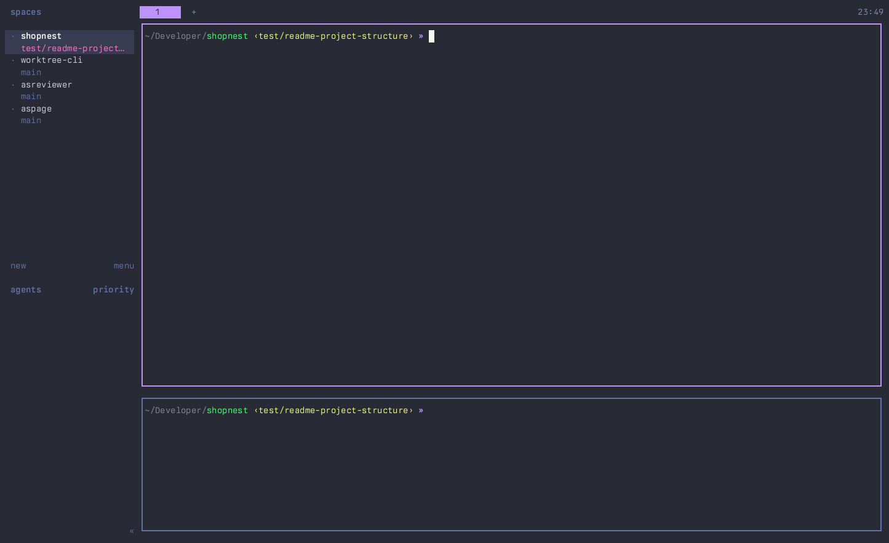

# asgitlog

Browse the git history of a repository from the terminal: a filterable commit
list with a preview of the selected commit. The diff in the preview is
rendered by [delta](https://github.com/dandavison/delta). It runs as a
[herdr](https://github.com/asumaran/herdr) plugin popup, on the repository of
the pane you were in, and as a plain command in any shell.



- The list shows hash, author, subject, refs and date. With the preview on
  the side it switches to hash, age and subject.
- The preview has the commit header (hash, refs, author, date, files changed
  with `+added -removed` per file, full message) followed by the diff, side
  by side or in a single column.
- `enter` opens the diff full screen, with pager keys, text search, jumps
  between files and between commits.
- Uncommitted changes show up as a row of their own above the newest commit.
- The log can be widened to all refs, or narrowed to the commits that added
  or removed a piece of text (`git log -S`).
- The layout, the diff mode and the size of the list are remembered across
  runs.

## Install

```
herdr plugin install asumaran/asgitlog
```

The manifest's `[[build]]` runs `scripts/fetch-binary.sh`, which downloads the
release binary matching the manifest version and falls back to `go build`
(`ASGITLOG_BUILD_FROM_SOURCE=1` skips the download). Requires herdr >= 0.7.5
and `git`. Install `delta` too: without it the diff falls back to git's own
colors. Prebuilt binaries for macOS and Linux (arm64 and amd64); anything else builds from source.

Bind a key to the `open` action in `~/.config/herdr/config.toml`:

```toml
[[keys.command]]
key = ["ctrl+alt+l"]
type = "plugin_action"
command = "asumaran.asgitlog.open"
description = "asgitlog (git log browser)"
```

To use it outside herdr, put the binary on your `PATH` (a symlink to the
plugin's `asgitlog` works) and run it inside any repository:

```
asgitlog                      # the current branch
asgitlog main..feature        # any revision or range git log accepts
asgitlog -- src/ui README.md  # only commits touching these paths
```

With paths, the preview's diff and file list are limited to them too.

## Usage

The filter input is focused on open, so just type. Words are matched anywhere
in the row (hash, author, email, subject, refs, date), ignoring case, and all
of them must match. Prefix a word with `~` to match it fuzzily (`~prvw` finds
"preview"). Commits always stay in log order.

The list starts right under the filter input with the newest commit and goes
down the history.

| Key | Action |
| --- | --- |
| `↑`/`↓`, `ctrl+p`/`ctrl+n` | move the selection |
| `pgup`/`pgdn` | move a page |
| `alt+↑`/`alt+↓` (`⌥` on a Mac) | jump to the top / bottom of the list |
| `home`/`end` (`fn+←`/`fn+→` on a compact Mac keyboard) | jump to the newest / oldest commit |
| `enter` | open the diff full screen |
| `tab`/`shift+tab` | scroll the preview to the next / previous file |
| `shift+↑`/`shift+↓`, mouse wheel over the preview | scroll the preview |
| mouse wheel over the list | move the selection |
| left click | select a commit |
| `ctrl+t` | diff mode: auto, side-by-side, single column |
| `ctrl+r` | render the diffs with delta or with [hunk](https://hunk.dev) (when installed) |
| `ctrl+s` | show or ignore whitespace changes, like GitHub's "Hide whitespace" (`git show -w`, remembered); `[-w]` on the bottom edge while it is on |
| `ctrl+l` | preview below (rows) / on the side (columns) |
| `shift+←`/`shift+→` | shrink / grow the list |
| `ctrl+a` | all refs / current branch |
| `ctrl+g` | search the diffs: only commits that add or remove a text |
| `ctrl+y` | copy the commit hash |
| `ctrl+o` | open the commit on the remote's web page |
| `?` (empty filter) or `f1` | expand / fold the full key help |
| `esc`, `ctrl+c`, `q` with an empty filter | quit |

In the full-screen diff:

| Key | Action |
| --- | --- |
| `↑`/`↓`/`j`/`k`, `space`/`b`, `d`/`u` | scroll a line, a page, half a page |
| `g`/`G` | top / bottom |
| `]`/`[` or `→`/`←` | older / newer commit |
| `tab`/`shift+tab` | next / previous file |
| `/`, then `n`/`N` | search, next / previous match (`esc` clears) |
| `ctrl+t`, `ctrl+r`, `ctrl+s`, `y`, `o`, `?` | diff mode, delta / hunk, whitespace, copy hash, open in browser, full key help |
| `q`, `esc` | back to the list |

## Behavior notes

- As a herdr popup it browses the repository of the pane that was focused
  when it opened; from a shell, the one of the current directory. Outside a
  repository it says so and exits.
- The history is streamed, so a large repository is usable while the rest
  loads. The counter next to the input shows `matches/total` and whatever the
  log is scoped to.
- The selection survives layout changes, resizes and filter edits: deleting
  the query leaves you on the commit you found, with its neighbors around.
- The commits around the selected one are rendered ahead (a few in the
  direction you are moving, up to three at a time), so stepping through the
  log does not wait for the renderer.
- Rendered diffs are kept in `${XDG_CACHE_HOME:-~/.cache}/asgitlog/renders`
  (up to 128 MiB, least recently used dropped first), so a commit you have
  seen shows instantly the next time, also in a new session. They are keyed
  by the renderer's binary and configuration, so an upgrade or a theme change
  renders afresh. `ASGITLOG_NO_CACHE=1` turns it off.
- The auto diff mode goes side by side when the preview is at least 120
  columns wide. delta gets an explicit `--width` and `--side-by-side` or not;
  everything else (theme, line numbers, ...) comes from your own delta
  configuration. Jumping between files relies on delta's default file
  header (the path over a rule).
- `ctrl+r` hands the diffs to hunk instead, for its looks only: hunk is a
  full-screen program with no plain output, so asgitlog runs it on an
  off-screen terminal tall enough for the whole patch and shows what it drew.
  The diff shows as soon as hunk has drawn it (about 0.2 s) and its syntax
  highlighting fills in a moment later, the way it does in hunk itself. A
  patch is cut at 4000 rows.
  Theme and the rest come from your hunk configuration.
- A merge is shown as the diff against its first parent, that is, what the
  merge brought into the branch.
- The working tree row previews `git diff HEAD` and lists untracked files.
- `ctrl+o` builds the URL from the `origin` remote (or the upstream's remote)
  and knows the GitHub, GitLab and Bitbucket commit paths.
- Settings live in `${XDG_STATE_HOME:-~/.local/state}/asgitlog/` (`layout`,
  `diff`, `renderer`, `whitespace`, `split-rows`, `split-columns`), shared by the popup and the shell
  command.
- `ASGITLOG_POPUP_WIDTH` / `ASGITLOG_POPUP_HEIGHT` (e.g. `95%`) override the
  popup size from the manifest (85% x 90%). `ASGITLOG_CLIPBOARD` and
  `ASGITLOG_OPENER` replace the clipboard command (`pbcopy` on macOS; `wl-copy`,
  `xclip` or `xsel` on Linux) and the browser opener (`xdg-open` on Linux).

## Development

```bash
go build -o asgitlog .     # local build (plugin runs ./asgitlog from the repo root)
./asgitlog -dump           # repo summary, settings and the first rows (no TTY)
./asgitlog -dump -query fix -n 0          # rows matching a query
./asgitlog -dump -show HEAD -width 140    # a commit's preview, header + delta
go vet ./... && go test ./...
scripts/pty-check.py ./asgitlog           # end-to-end on a pty (python3 + pyte)
herdr plugin link "$PWD"   # register the working copy (no build step)
```

## Demo recording

`docs/demo.gif` is recorded with
[asdemokit](https://github.com/asumaran/asdemokit): `asdemo
record` from the repo root replays `scripts/demo/keys.json` against an
isolated herdr session described by `scripts/demo/scenario.sh`, which starts
on a personal repository so no work history shows up.

## Releasing

`scripts/release.sh <X.Y.Z>` gates on a clean tree + green vet/build/test,
generates the CHANGELOG entry from commit subjects, syncs the manifest
version, commits, tags and publishes the GitHub release; CI then attaches
the `asgitlog-<os>-<arch>` binaries (macOS and Linux, arm64 and amd64), the assets `fetch-binary.sh` downloads on installs.
